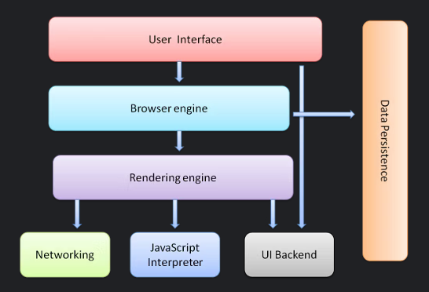
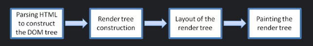
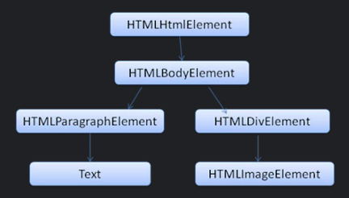
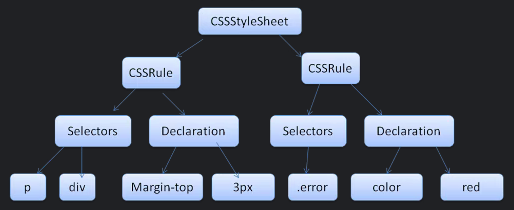

# Assignment 1.1

- Detailed Answer
    - Whenever a user enters a url into the addrsss bar of the browser, a lot of steps are undergone
    - We’ll break & try to understand the flow in parts:
        - DNS lookup
            
            This is the first step of navigating to a webpage. Every URL is located on a server with a specific IP address. If we have never visited the site, a DNS Lookup is going to take place. Bowser is going to make a request to a name server.
            
            Every server is fielded by a name server, which responds with an IP address of the server. After this initial request this IP is cached for a time, which speeds up subsequent requests by retrieving the IP address from the cache instead of contacting a name server again.
            
        - TCP Handshake
            
            Once the IP address is known, the browser sets up a connection to the server via a TCP handshake. This mechanism is designed so that two entities attempting to communicate, in this case the browser and web server, can negotiate the parameters of the network TCP socket connection before transmitting data, often over HTTPS.
            
            TCP's three-way handshaking technique is often referred to as "SYN-SYN-ACK"—or more accurately SYN, SYN-ACK, ACK—because there are three messages transmitted by TCP to negotiate and start a TCP session between two computers. Yes, this means three more messages back and forth between each server, and the request has yet to be made.
            
        - TLS negotiation
            
            For secure connections established over HTTPS, another "handshake" is required. This handshake, or rather the TLS negotiation, determines which cipher will be used to encrypt the communication, verifies the server, and establishes that a secure connection is in place before beginning the actual transfer of data. This requires three more round trips to the server before the request for content is actually sent.
            
            This increases the load time, but it ensures that the data transmitted between the browser and the server is secured & cannot be decrypted by third party.
            
            After the 8 round trips, the browser is finally able to make the request.
            
        - Response
            
            This is when the first request to the server is made and browser sends an intial HTTP GET request, which in most cases an HTML file. Once the server receives the request it replies  with relevant response headers and the contents of the HTML.
            
        - Main functionality of the browser
            
            It is to display the webpage by showing its resources from a server. The resources are mostly a HTML document, images, pdfs, etc. The way the browser interprets & displays HTML files is maintained by a set of specifications created by the W3C.
            
        - Components of a browser
            
            The main components of a browser are as follows:
            
            1. User Interface: this includes an address bar, back/forward button, bookmarks menu, settings menu, etc
            2. Browser Engine: this take care of the actions between the UI & the renderig engine
            3. Rendering Engine: it is responsible for parsing the HTML & CSS, and displays the parsed content on the screen
            4. Networking: it is responsible for making the network requests
            5. UI Backend: it uses the user interface methods of the system’s operating system. It is mainly used for drawing basic widgets like windows, combo boxes, etc.
            6. Javascript Interpretor: it is used to parse javascript code
            7. Data Storage: This acts as a persisence layer. The storage mechanisms used are localStorage, sessionStorage, cookies, indexedDB, WebSQL, FileSystem
            
            
            
        - One of the most important Components is the rendering engine. It can display HTML & XML documents & images. It uses other built in plugins to display PDFs, videos, etc. Let’s talk a bit about rendering engine
        - Rendering engine
            
            Different browsers use different rendering engines, like Firefox uses Gecko, Chrome & Opera use Blink, a modified version of WebKit
            
            The networking layer will start giving contents of the requested document to the rendering engine in chunks of 8kb.
            
            
            
                                                                  Rendring engine’s basic flow
            
            The rendering engine will start **parsing** the HTML document & convert element to DOM nodes in a tree called the ***“content tree”*** or the ***“DOM tree”***. Then the engine will parse the CSS to create a tree with style data. Now both these trees are used to create another tree called the **“*render tree”.***
            
            After the render tree is created it goes through a *“layout creation”* process. In this step each node of the tree is assigned a coordinate in the browser’s display window. After this all the nodes are *“painted”*  by traversing (parsing) the render tree & each nide will be painted using the UI backend layer.
            
            Now, talking about parsing, it is one of the most important steps which is done by the rendering engine.
            
        - Parsing
            - HTML Parsing
                - Parsing an HTML document means to convert the document into a form which the browsers can interpret. As explained earlier parsing gives us a tree
                - Parsing can be separated into 2 sub processes: lexical analysis & syntax analysis
                - Lexical analysis is the process of breaking the input into small building blocks called Tokens
                - Syntax analysis is the applying the language specific rules to the tokens and creating a tree out of it
                - There are different types of parsers:
                    - HTML parser: it parses the HTML markup into a parse tree. It uses the language specifications for the conversion created by the W3C. The output of this parsing is the **************“parse tree”.************** The output tree is a tree of DOM (Document Object Model) elements and their respective attribute nodes. The DOM has 1:1 relation to the markup. For example:
                        
                        ```jsx
                        <html>
                          <body>
                            <p>
                              Hello World
                            </p>
                            <div> </div>
                          </body>
                        </html>
                        ```
                        
                    - The above markup would be translated to the following DOM tree:
                        
                        
                        
                - Once the HTML parsing is finished the browser starts parsing scripts that were marked to be parsed after the document is parsed.
            - CSS Parsing
                - CSS parsing gives us a StyleSheet object & each object contains CSS rules. These CSS rule objects contain selector objects. For example: the below CSS code is converted into a tree as shown
                
                ```css
                p, div {
                	margin-top: 3px;
                }
                .error {
                	color: red;
                }
                ```
                
                
                
            - Script Parsing & their processing order
                - When it comes to script parsing there are lot of nuances which one needs to take care of. Web behaves synchronously in nature, as soon the parser encounters any `<script>` tag it stops the parsing of the document until the script has been executed. In case of external script, the resource needs to be fetched first from the network, as this is done synchronously, the parsing is halted until the resource is fetched.
                - But now we can mark “defer” attribute to the resource tags, so that the resource does not blocks the HTML parsing & will execute the script after the document parsing is complete
                - Currently, browsers uses other threads to parse the document and find out what other resources need to loaded from the network and loads them. This way resources can be loaded on parallel connections and overall speed of the parsing and dowloading is improved
                - Document parsing is stopped because of the reason that scripts can modify the DOM tree but CSS does not modify the DOM tree, so the parsers does not wait for the CSS to load. But in scenarios where the scripts ask for style information during the document parsing stage, the browsers blocks all the scripts when they try to access style properties that may be affected the unloaded style sheets
        - Render tree construction
            
            While the DOM tree is being constructed, the browser constructs another tree, the render tree. This tree is of visual elements in the order in which they will be displayed.
            
            The relation of the render tree with the DOM tree comes into play when CSSOM (CSS Object Model) is ready. As mentioned earlier the CSS parser goes through each node and gets the styles attributed to it and create a CSSOM.
            
            Now the DOM & CSSOM are combined together to create a Render Tree. The important thing here is to create the render tree by applying the rules in the correct order, this means taken into consideration:
            
            - browser declarations
            - user normal declarations
            - author normal declarations
            - author important declarations
            - user important declarations
            
            The browser declarations are least important and the user overrides the author only if the declaration was marked as important. Declarations with the same order will be sorted by **specificity** and then the order they are specified. The HTML visual attributes are translated to matching CSS declarations . They are treated as author rules with low priority.
            
        - Layout
            
            In this step, the position & height-width of each visible element is calculated. Every time there is an update to the render tree, or the size of the viewport changes, the browser has to run layout again.
            
            There are scenarios when asynchronous contents from network forces creation of new render tree.
            
            But a lot of optimizations are done under the hood to improve the render performance., like in case of window resizing, the render sizes are taken from a cache. So, only a subtree is modified and layout is not started from the root.
            
        - Painting
            
            when we get to the paint stage, the browser has to pick up the layout result, and paint the pixels to the screen, beware in this stage that not all styles have the same paint time, also combinations of styles can have a greater paint time than the sum of their parts. For an instance mixing a border-radius with a box-shadow, can triple the paint time of an element instead of using just one of the latter.
            
            This step uses the UI Infrastructure component. Also, there is a defined specification in which the elements are painted.
            
            There are lot of optimizations done by the browsers in this step to limit the number of actions in response to change(s).
            
            Also, the rendering engine is single threaded. Almost, everything except network operations, happens in a single thread. Network operations can be performed by several parallel threads. Network ooperations can be performed by many parallel threads.
            
    - As explained earlier that Javascript is parser blocking and CSSOM is render blocking. The one step of creating CSSOM is blocking rendering and Javascript execution. There are only 2 cases when Javascript does not gets blocked on CSSOM:
        1. inline scripts above the CSS files `<link>` in the `<head>`
        2. Async scripts

---

---

- Summarised Answer
    
    Whenever a user enters a URL into the browser, browser makes a request to a name server which gives back an IP address of the server. The browser then sets up a secured connection with the server with TCP handshake followed by a TLS negotiation.
    
    The browser then sends the first HTTP request which the server responds with a HTML file, which the browser then renders. In order to render thge content the browser has to go through a series of steps:
    
    1. Document Object Model (DOM)
    2. CSS object model (CSSOM)
    3. Render Tree
    4. Layout
    5. Paint
    
    1. ******************************************Document Object Model:****************************************** To process a html file and get to the document object model event the browser has to go through 4 steps:
        1. Convert bytes to characters
        2. Identify tokens
        3. Convert tokens to nodes
        4. Build DOM Tree
        
        This entire process can take some time, also, as the HTML parser finds any links for CSS or Javascript, it immideiately sends a request for them, after that it also sends requests for all the other assets found in the rest of the page like for images, videos, etc.
        
        When this process is finished the browser will have the full content of the page, but to able to render te browser has to wait for CSS object model, also known as the CSSOM event, which will tell the browser how the element should look like when rendered.
        
    2. ************************************CSS Object Model:************************************ Similar to the DOM, the CSS also goes through a CSS parser & on the basis of some predefined rules, it goes through the same steps as that of the DOM.
    As, the browser blocks page rendering until it receives & processes all the css files in your page, CSS is render blocking.
    3. **Render Tree:** This stage is where the browser combines the DOM and CSSOM, this process outputs a final render tree, which contains both the content and the style information of all the visible content on the screen.
    4. **Layout:** This stage is where the browser calculates the size and position of each visible element on the page, every time an update to the render tree is made, or the size of the viewport changes, the browser has to run layout again.
    5. **Paint:** When we get to the paint stage, the browser has to pick up the layout result, and paint the pixels to the screen, in this stage not all styles have the same paint times, also combinations of styles can have a greater paint time than the sum of their parts. For an instance mixing a border-radius with a box-shadow, can triple the paint time of an element instead of using just one of the latter.
    
    Javascript can manipulate both DOM & CSSOM, so to execute Javascript, the browser has to wait for the DOM, then it has to download and parse all the CSS files, get to the CSSOM event and only then finally execute Javscript.
    
    The CSSOM event is blocking rendering & Javasciprt execution. There are only 2 cases when Javascript does not block on CSSOM:
    
    1. Inlined scripts above the css files `<link>` in the `<head>`
    2. Async scripts
    